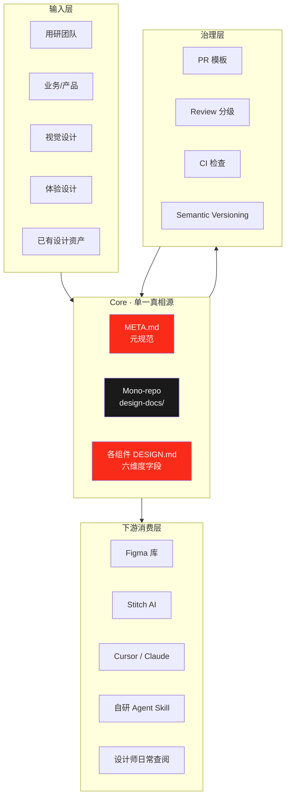
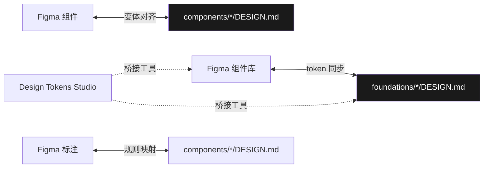
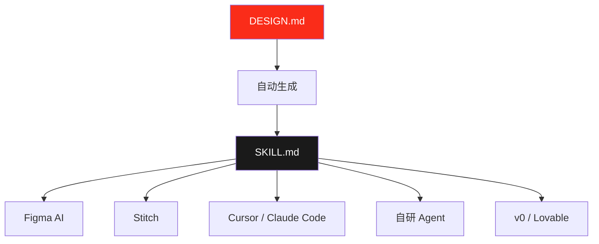

# JD Design OS · 京东设计系统基础设施方案

> 一份从双列卡专项生长出来的系统性方案 —— 让京东的设计系统像代码一样可协作、可追溯、可被 AI 消费。

**版本**：v0.1 Draft
**日期**：2026-04-24
**作者**：综合业务设计组（Shaka 主导）
**状态**：方案草案（内部已授权推进）
**基调**：不是"建一套新的设计系统"，是**"让京东已有的设计 wiki 真正被用起来"**

---

## 执行摘要（TL;DR）

**京东已经有自己的设计 wiki**（多年沉淀）。但在 AI 时代，现有 wiki 暴露出三个结构性局限：

1. **写给人读，AI 读不懂** —— Figma AI / Cursor / 自研 agent 消费不了
2. **散落多处，没有单一真相源** —— 同组件多版本并存
3. **静态文档，和 Figma、线上实现、AB 数据都脱节** —— "写完躺着"

双列卡专项（`jd-double-column-card` · v0.5.2）是我们在小范围做出的 **"wiki 用起来"** 的样本。本方案要做的，**不是建一套新的设计系统**——而是**把现有 wiki 升级为活的、AI 可消费、可协作迭代的设计系统**。

### 一句话价值主张

> **让京东的设计 wiki 在 AI 时代真正被用起来** —— 从"写完就躺着"升级到"AI 能用、人也能用、工具链全打通"。

### 三个层级

```
第一层：单一真相源      →  DESIGN.md × META Schema（文档规范化）
第二层：多角色共建      →  Git 工作流 + Review 分级（组织协作化）
第三层：下游 AI 消费    →  Figma / Stitch / Cursor / Agent 接入（工具链闭环）
```

### 参考外部标杆

| 来源 | 借鉴点 |
|---|---|
| 老板框架（design-docs/6 层分类）| 目录结构骨架 + ADR 机制 |
| Google Material Design 3 | Design tokens 体系 + 组件文档范式 |
| Shopify Polaris / Atlassian DS | GitHub 协作 + Contribution guide |
| Vercel Geist / v0 AI | AI-ready 设计系统的最佳实践 |
| Claude Skills / Stitch design-md | AI agent 消费 DESIGN.md 的标准协议 |
| 京东商业架构体系 | 补充商业层（其他设计系统普遍缺失） |

### 时间表

| 阶段 | 周期 | 关键产出 |
|---|---|---|
| P1 | 2 周 | META.md v0.1 + jd-double-column-card 按新规范重组（样本）|
| P2 | 1-2 月 | Mono-repo 建立 + 2-3 个组件接入 |
| P3 | 2-3 月 | 5-10 个组件 + Figma 打通 + CI 成熟 |
| P4 | 6 个月 | 全站推广 + AI 消费链闭环 |

### 预期产出

- 一份可推广的 META Schema（"如何写 DESIGN.md"）
- 一个 Mono-repo（京东设计系统源码化）
- 一套多角色协作工作流（用研/体验/视觉/商业/产品）
- Figma ↔ DESIGN.md ↔ Skill 的三方联动链路
- 所有已交付的组件都有对应 AI skill，可被下游工具直接消费

---

## 第一章 · 背景与问题

### 1.1 京东多业务线共生的挑战

京东 App 不是单一产品，是**多业务线共生的超级平台**：推荐 / 点评 / 圈子 / 新品 / 直播 / 个人中心 / 搜索 / 详情页 / 购物车 / ... 每条业务线都有独立的设计诉求、开发节奏、KPI。

### 1.2 现有 wiki 的 AI 时代局限

**京东已经有自己的设计 wiki**——包含设计语言、组件规范、品牌指南、多业务线的约束。这些是多年沉淀下来的资产，不应该否定。

**但在 AI 时代，现有 wiki 暴露出三个结构性局限**：

#### 局限 1 · 写给人读，AI 读不懂

- 现有 wiki 多是自然语言描述（"卡片要有呼吸感""颜色要柔和"）
- 没有结构化 schema，没有 machine-readable token 字段
- **结果**：Figma AI / Cursor / 自研 agent 都"读不懂 wiki"，每次都要人工"翻译"，出错率高

#### 局限 2 · 散落多处，没有单一真相源

- 推荐团队有一版双列卡规范、点评团队有另一版、直播又是一版
- Figma 库、Confluence、内部 wiki、项目 PRD 之间互不同步
- **结果**：同一个组件，不同团队眼中是不同的东西；新人 onboard 要问 10+ 个人

#### 局限 3 · 静态文档，不是活系统

- wiki 写了就放在那里，变成"死文档"
- 和 Figma 库不同步（规范说 12px，Figma 还是 10px）
- 和线上实现不同步（线上跑的和规范说的不一样）
- 和 AB 实验数据不同步（数据发现问题，反哺不回规范）
- **结果**：wiki 沦为"自嗨产物"，没有真正驱动产品决策

#### 副作用：商业价值难以证明

- 设计动作和商业目标脱钩，汇报时无法论证"这份规范为什么值"
- 业务线疲于各自跑 KPI，没有动力共建统一系统

### 1.3 所以我们的任务不是"建新的"，是"让它用起来"

**定位转变**：
- ❌ 不是"从零建一个 JD Design System"（那是对已有投资的否定）
- ✅ 是 **"升级现有 wiki，让它在 AI 时代真正被消费、被共建、被反馈"**

### 1.4 已有尝试的成果

**双列卡专项**（`jd-double-column-card` · v0.5.2）已在小范围跑通了：
- 五大家族 DNA + 9 条 L1 规约 + 8 条核心原则
- 22 个基线样式采集
- Skill 化 & 开源（https://github.com/ShuaiMXu/jd-double-column-card-skill）
- 跨 Agent 可复用（PE 模板已就位）

**这是"wiki 用起来"的 v0.0 样本**。本方案的核心工作 = **把这个样本的方法论抽象化，反推出可推广到现有 wiki 的元规范**。

---

## 第二章 · 外部标杆与行业实践

> 完整调研见附录 F。本章浓缩核心结论。

### 2.1 主流设计系统对标（5 家）

| 系统 | 归属 | 治理模型 | 适合京东的程度 |
|---|---|---|---|
| **Material Design 3** | Google | 中央化、品牌主导 | ⭐⭐ 参考字段 |
| **Shopify Polaris** | Shopify | 轻治理 + 强工具链 + Content guidelines 一等字段 | ⭐⭐⭐⭐ 组件模板最值得借鉴 |
| **Atlassian DS** | Atlassian | 中心委员会 + 内部贡献 | ⭐⭐⭐ |
| **IBM Carbon** | IBM | **重治理 + 分层准入**（Experimental→Beta→Stable）+ steering committee | ⭐⭐⭐⭐⭐ **治理模型最像京东** |
| **Vercel Geist / v0** | Vercel | 轻治理 + **AI 原生**（shadcn Registry + MCP）| ⭐⭐⭐⭐ AI 接入直接借鉴 |

**关键洞察**：
- **其他 4 家都是"人读文档"模式**，只有 **Vercel Geist + v0 + shadcn Registry + MCP** 是真正 AI 原生
- → **这是京东弯道超车的机会点**。如果京东第一天就按 AI-ready 设计，等 Figma AI / 竞品 AI 工具成熟时，京东已经在前面

### 2.2 Skill 生态的事实标准

**2025-12 Anthropic 开源 `agentskills.io`，行业趋同**：

| 采纳方 | 状态 |
|---|---|
| Microsoft Copilot | ✓ |
| OpenAI | ✓ |
| Atlassian | ✓ |
| Figma | ✓ |
| Cursor | ✓ |
| GitHub Copilot | ✓ |
| Vercel Skills CLI | ✓（跨 45+ agent 分发）|

**标准结构**：
```
skill-name/
├── SKILL.md           # 核心文件，YAML frontmatter
├── references/        # 按需加载的详细资料（Progressive disclosure）
├── examples/          # gold-standard 样例（设计 skill 必须有）
├── scripts/           # 可执行工具（可选）
└── resources/         # 资源文件（可选）
```

**对京东的意义**：**不发明私有格式**。京东 DESIGN.md → 直接兼容 `agentskills.io` → 45+ 宿主 agent 零成本消费。

### 2.3 Figma 工具链事实标准（2025-10 稳定）

```
设计意图 ──→ Tokens Studio（Figma 插件）──→ W3C DTCG JSON
                                              │
                                              ├─→ Style Dictionary ──→ CSS/iOS/Android
                                              └─→ Figma Code Connect ──→ 代码绑定
```

**W3C DTCG**（Design Token Community Group）已是事实标准。京东直接采用，不需要内部约定。

### 2.4 对京东的 5 个关键启示

1. **不发明私有格式**：SKILL 格式用 `agentskills.io`，Token 格式用 W3C DTCG
2. **治理模型参考 Carbon**（成熟度分层 + steering committee），不是 Polaris 的轻治理
3. **组件模板骨架参考 Polaris**（Examples/Props/Best practices/Content/Accessibility/Related 六段式）
4. **AI 接入不等，从第一天就做**（借鉴 Vercel v0 + shadcn Registry 模式）
5. **Stitch `design-md` 的 5 步管道**（Retrieval→Extraction→Translation→Synthesis→Alignment）**和你的双列卡方法论完全同构** → 替换原则就能复用

---

## 第三章 · JD Design OS 架构设计

### 3.1 架构总览



### 3.2 五层目录架构

在老板框架基础上**增强**（不推翻）：

```
jd-design-system/                  # Mono-repo 根目录
├── META.md                        # ★ 新增：元规范（如何写 DESIGN.md）
├── principles/                    # 老板：设计哲学（京东设计原则 / AI 交互原则）
│   ├── ai-interaction.md
│   └── e-commerce-experience.md
├── guidelines/                    # 老板：设计指南（跨组件的规则）
│   ├── accessibility.md
│   └── responsible-ai-ui.md
├── business/                      # ★ 新增：商业层（策略/目标/指标）
│   ├── traffic-distribution.md
│   ├── conversion-funnel.md
│   └── cross-biz-alignment.md
├── research/                      # 老板：用研洞察
│   ├── user-personas.md
│   ├── journey-maps.md
│   └── user-trust-study.md
├── foundations/                   # ★ 新增：基础层（跨组件 token）
│   ├── color/DESIGN.md
│   ├── typography/DESIGN.md
│   └── spacing/DESIGN.md
├── components/                    # 老板：组件规范
│   ├── double-column-card/        # 已有样本
│   │   ├── DESIGN.md
│   │   ├── variants/              # 变体案例库
│   │   └── skill/                 # 对应 AI skill
│   └── ...
├── patterns/                      # 老板:交互模式
│   └── streaming-output.md
├── contexts/                      # ★ 新增：场景层（按业务线组织）
│   ├── recommendation/
│   ├── review/
│   ├── live/
│   ├── new-product/
│   └── community/
├── decisions/                     # 老板:ADR 决策记录
│   └── 2026-04-design-os.md
└── governance/                    # ★ 新增:治理层
    ├── review-process.md
    ├── versioning.md
    ├── pr-template.md
    └── contributor-guide.md
```

### 3.3 六维度字段 · 组件 DESIGN.md 模板

> **这是整个方案的核心创新点**：一份 DESIGN.md，六维度同源，多角色各取所需。
> **参考**：Polaris 组件模板（六段式最完整）+ 商业层（京东独有）+ AI 消费字段（Stitch design-md 启发）

每个组件的 DESIGN.md 都必须按以下结构写（**顺序固定**）：

| # | 段落 | 谁写 | 谁读 | AI 可读 | 外部对标 |
|---|---|---|---|---|---|
| 0 | **基本信息（Meta）** | 组件 owner | 全员 | ✓ YAML frontmatter | agentskills.io 兼容 |
| 1 | **概述** | owner | 全员 | ✓ | Material / Polaris |
| 2 | **业务视角（Business）** | 产品 / 业务 | 管理层 / 老板 | ✓ | ★ 京东独有 |
| 3 | **用户视角（Research）** | 用研 | 设计 / 产品 | 部分 | 行业少见 |
| 4 | **体验视角（Experience）** | 体验设计 | 设计师 | ✓ 家族 DNA / 规则 | Polaris Best practices |
| 5 | **视觉视角（Visual）** | 视觉设计 | 设计师 / 开发 | ✓ W3C DTCG Token | Material / Carbon |
| 6 | **交互视角** | 交互 | 设计师 / 开发 | ✓ 状态机 | Polaris Examples |
| 7 | **Content Guidelines（文案规范）** | 内容策略 | 设计师 / 运营 | ✓ | ★ Polaris 一等字段 |
| 8 | 禁止用法（Don'ts）| owner | 全员 | ✓ | Polaris / 老板框架 |
| 9 | **AI 消费字段** | owner | AI agent | ✓ 结构化 YAML | Stitch design-md |
| 10 | 示例 | owner | 全员 | — | Polaris Examples |
| 11 | 变更记录 | 自动生成 | 全员 | — | Polaris Changelog |

**关键亮点**：同一份 DESIGN.md 被**七个角色**从各自切面读出不同内容：
- **老板** 看 Business 段 → 看到 ROI 论证
- **用研** 看 Research 段 → 看到洞察被采纳
- **设计师** 看 Experience + Visual + Interaction → 可执行规范
- **内容运营** 看 Content Guidelines → 文案一致性（中文电商场景关键）
- **AI agent** 看 AI 消费字段 + Meta → 结构化数据
- **评审委员会** 看 Don'ts + Business → 裁决边界

**这解决了多团队协作"谁写谁用"混乱的根本矛盾**。

### 3.4 治理层：像代码一样管理设计系统

**借鉴工程界 + IBM Carbon 分层准入**：

| 工程实践 | DESIGN OS 对应 | 解决什么 | 外部对标 |
|---|---|---|---|
| Git 分支策略 | main 稳定版 / feature 新组件 | 变更可追溯 / 可回滚 | 通用 |
| PR 模板 | 强制填写变更理由 / 影响 / A-B 数据 | 变更可评审 | Polaris |
| Code Review | Review 按层级召集角色 | 权威 + 多角度把关 | Carbon steering |
| CI / Lint | METAlint 工具检查 DESIGN.md 合规 | 自动质量门 | shadcn Registry |
| Semantic Versioning | X.Y.Z 规范 | 下游知道影响范围 | 通用 |
| Changelog 自动生成 | 记录每次变更 | 可追溯 | Polaris |
| GitHub Issues | 设计诉求入口 | 需求集中管理 | 通用 |
| **★ 成熟度分层** | `Experimental / Beta / Stable / Deprecated` | 新组件试验 + 稳定组件保护 | **Carbon（核心借鉴）** |
| **★ Steering Committee** | 跨业务设计治理委员会 | 规范争议裁决 | **Carbon** |

**成熟度分层的作用**：
- **Experimental**：业务方可以试用但不保证稳定（类似 alpha）
- **Beta**：规范基本稳定但仍可能调整（类似 beta）
- **Stable**：稳定，破坏性变更需走严格流程
- **Deprecated**：废弃中，附迁移路径

**为什么京东必须用分层准入**：多业务线并发变更，没分层就是"大家改同一个 stable 组件，炸成连环故障"。

详细 Review 分级见第 5 章。

---

## 第四章 · 京东商业架构体系融合

### 4.1 为什么需要商业层

其他主流设计系统（Material / Polaris / Atlassian）**普遍缺失商业层**——因为它们大多面向"通用 SaaS 产品"，没有电商特有的"商业-设计"强耦合。

**京东不一样**：
- 每个卡片都承担具体商业任务（GMV / 转化率 / 客单价 / 停留时长 / 复购率）
- 设计决策影响真实商业指标
- 如果设计系统不显式表达商业目标，设计会和业务脱节

### 4.2 商业层的内容结构

```
business/
├── traffic-distribution.md      # 流量分发策略（首页推荐 vs 搜索 vs 个人页）
├── conversion-funnel.md          # 转化漏斗（发现 → 决策 → 转化）
├── commercial-metrics.md         # 核心商业指标定义（CTR / GMV / 转化率）
├── business-line-alignment.md    # 业务线对齐（5 大家族对应的商业角色）
└── seasonal-patterns.md          # 节奏规律（618 / 双11 / 年货节 的特殊规则）
```

### 4.3 商业字段的 schema（组件级）

每个组件 DESIGN.md 的 Business 段至少包含：

```yaml
business:
  primary_goal: "触发点击与种草"  # 主要商业目标
  kpi_metrics:
    - name: CTR
      baseline: 5.2%
      target: 7.0%
    - name: 种草率
      baseline: 1.8%
      target: 3.0%
  business_lines_served: [推荐, 点评, 圈子]
  commercial_cost: "每张卡承载 0-1 个商品挂载"
  seasonal_variance: "大促期间可启用红色氛围变体"
```

### 4.4 商业层 × 其他视角的互锁

**商业目标驱动设计决策**，不是反过来：


---

## 第五章 · 多角色共建机制

### 5.1 谁写谁读：单一真相源的多视角可读

**核心原则**：**一份 DESIGN.md，多视角同源**。不需要多个文档互相对齐。

```
                ┌──────────────────┐
                │    DESIGN.md     │
                │ (单一真相源)     │
                └───────┬──────────┘
                        │
      ┌─────────┬───────┼───────┬─────────┐
      │         │       │       │         │
   用研视角  产品视角  设计视角  开发视角  AI 视角
   读 Research 读 Business 读 E+V+I 读 Visual+AI 读全部结构化
```

### 5.2 PR 模板

```markdown
## 变更类型
- [ ] Foundation token 变更
- [ ] 组件规则变更
- [ ] 场景变体新增
- [ ] 文案 / 描述修订
- [ ] ADR 决策新增

## 变更理由
（为什么要做这个变更？解决什么问题？）

## 影响范围
- 受影响组件：
- 受影响业务线：
- 受影响 AI 工具：

## 数据支撑 / 用研证据
（A/B 实验结果 / 用研报告链接 / 业务数据）

## 关联 ADR
- 如果这是个重要决策：引用 decisions/ 下的 ADR

## 自检清单
- [ ] 符合 META.md 的 schema 规范
- [ ] 六维度字段完整
- [ ] 变更记录已更新
- [ ] 对应 AI skill 已同步
```

### 5.3 Review 分级

| 变更层级 | 谁 Review | SLA |
|---|---|---|
| `principles/` 根原则 | 治理委员会 + 跨业务代表 | 3 工作日 |
| `foundations/` token | 基础组件 owner + 视觉负责人 | 2 工作日 |
| `components/` 组件规则 | 组件 owner + 2 业务线代表 | 2 工作日 |
| `business/` 商业层 | PM + 业务数据团队 | 3 工作日 |
| `research/` 用研 | 用研团队 + 组件 owner | 2 工作日 |
| 场景变体 | 业务线对接人 | 1 工作日 |
| 文案修订 | 组件 owner 自批 | 即时 |

### 5.4 角色接入路径

| 角色 | 接入方式 | 贡献形式 |
|---|---|---|
| **视觉设计师** | 主 workflow | 写 Visual / 变体提案 |
| **体验设计师** | 主 workflow | 写 Experience / 家族 DNA / 决策树 |
| **用研** | PR workflow | 写 Research / 提供数据 |
| **产品** | Issue + PR | 提业务诉求 / 写 Business |
| **开发** | 消费 + 反馈 | 从 Token 系统消费 / 提工程可行性反馈 |
| **AI Agent** | Subscribe Mono-repo | 定期拉取 META + 结构化字段 |

---

## 第六章 · Figma 打通方案

### 6.1 双向同步的挑战

**现状**：
- Figma 是视觉设计的唯一工具
- DESIGN.md 是规范的唯一源
- 两者不同步 → 设计稿和规范脱节

**目标**：建立 Figma ↔ DESIGN.md 的**双向同步链路**。

### 6.2 同步路径



### 6.3 Token 工程化（Design Tokens）

采用 **W3C DTCG 规范（2025-10 稳定）**，行业事实标准：

```json
{
  "color": {
    "brand": {
      "primary": { "value": "#fa2c19", "type": "color" }
    },
    "semantic": {
      "text-primary": { "value": "{color.neutral.900}", "type": "color" }
    }
  },
  "spacing": {
    "card-gap": { "value": "8px", "type": "dimension" }
  }
}
```

Token 单一真相源在 `foundations/`，然后自动：
- 导出成 CSS variables（给前端）
- 导出成 Figma token（给设计师）
- 导出成 Swift / Kotlin 变量（给原生端）

**工具链**（全行业事实标准 · 直接采用）：

```
Figma 设计稿
  └─→ Tokens Studio 插件（导出 W3C DTCG JSON）
       └─→ foundations/ 下的 JSON（Git 版本控制）
            ├─→ Style Dictionary ─→ CSS / iOS / Android 变量
            └─→ Figma Code Connect ─→ 设计组件和代码组件双向绑定
```

**Figma Code Connect** 是 Figma 2024 推出的"**设计组件 ↔ 代码组件**"官方绑定工具，让设计师在 Figma 里点一个组件就能看到对应代码片段。对京东的价值：设计师不用学 Git 也能让"自己的组件"进入系统。

### 6.4 组件库与 DESIGN.md 的映射

**Figma 组件** 和 **DESIGN.md** 一一对应：

- Figma 组件的 Description 字段 → 链接到 GitHub 的 DESIGN.md
- DESIGN.md 的 "示例" 段 → 嵌入 Figma embed link
- Figma 组件的 Variants → 对应 DESIGN.md 的 `variants/` 子目录

**未来**：用 Figma Plugin 自动生成 DESIGN.md 草稿（"从 Figma 导出规范"）。

### 6.5 设计评审双通道

设计评审不再只看 Figma：
- **Figma 评审**：看视觉效果
- **GitHub PR 评审**：看规则变更 + ADR + 商业影响

两者必须同时通过才能 Merge。

---

## 第七章 · Skill 化闭环

### 7.1 DESIGN.md → Skill 的转化路径

**核心思路**：每个组件的 DESIGN.md 都**自动生成**对应的 AI Skill，**兼容 agentskills.io 标准**（Anthropic 2025-12 开源，45+ 宿主 agent 已采纳）。

```
components/double-column-card/
├── DESIGN.md            ← 单一真相源
├── variants/            ← 变体案例库
└── skill/               ← 从 DESIGN.md 自动生成（兼容 agentskills.io）
    ├── SKILL.md         ← YAML frontmatter + 核心内容 <500 行（Progressive disclosure）
    ├── references/      ← 详细基线按需加载（京东 22 个基线）
    ├── examples/        ← ★ Gold standard 样例（设计 skill 必须有，Stitch 先例）
    ├── scripts/         ← 可选可执行工具
    └── resources/       ← 可选资源文件
```

**关键设计决策**：
- **采用 agentskills.io 标准** → 不发明私有格式 → 自动兼容 Microsoft Copilot / OpenAI / Figma / Cursor / GitHub Copilot 等 45+ 宿主
- **Progressive disclosure**：SKILL.md 核心 <500 行，详细内容放 `references/` 按需加载（避免 AI 上下文污染）
- **examples/ 是一等公民**：设计判断没有单元测试，gold-standard 样例就是验收标准（Stitch `design-md` 先例）

### 7.2 借鉴 Stitch `design-md` 的 5 步执行管道

**关键发现**：Stitch（Google 的 AI 设计工具）的 `design-md` skill 管道**和双列卡方法论完全同构**。

| Stitch 5 步 | 双列卡方法论对应 |
|---|---|
| **Retrieval**（检索资产）| 扫描截图 + 卡片地图 |
| **Extraction**（视觉识别）| 识别顶/中/底结构 |
| **Translation**（结构化翻译）| 提取 L1 规约 + 家族 DNA |
| **Synthesis**（综合）| 判断跨场景同物种识别 |
| **Alignment**（规范对齐）| 对照 DESIGN.md 做差异观察 |

**对京东的直接意义**：Stitch 的 skill 架构可直接套用到京东——**替换第 5 步的"Stitch 原则"为"京东 DESIGN.md 规则"**。

### 7.3 Skill 的消费方



### 7.4 双列卡 Skill 的演进（已跑通的模板）

v0.5.2 已完成：
- ✓ 独立 GitHub 仓库
- ✓ 五大家族 DNA + 9 条 L1 规约
- ✓ Agent PE 模板
- ✓ 跨 agent 可复用

**演进路径**：
- v0.6：对接新的 META Schema（本方案的产出）
- v0.7：接入 Figma（DESIGN.md 双向同步）
- v1.0：成为京东设计系统的官方 skill，推送到所有 agent 工具

### 7.5 Skill registry（借鉴 shadcn Registry + Vercel Skills）

建立京东内部的 Skill registry：

```
jd-design-system/skills/
├── registry.yaml        # 所有 skill 的索引
├── double-column-card/
├── detail-page/
├── search-result/
└── ...
```

**每个组件 = 一个 DESIGN.md = 一个 AI Skill = 一份可消费资产**。

---

## 第八章 · 实施路径（分阶段）

### P1 · Meta Schema 试点（2 周）

**目标**：拿出第一份可推广的 META.md + 样本。

**产出**：
- `META.md` v0.1（反推自 jd-double-column-card 的经验）
- `components/double-column-card/DESIGN.md`（按新模板重组）
- 一份"如何写 DESIGN.md"指南

**投入**：Shaka 本人 + 1 工程支持（Git 仓库初始化）

**里程碑**：内部 review 通过，拿到进入 P2 的授权。

---

### P2 · Mono-repo 建立 + 试点组件（1-2 月）

**目标**：建立基础设施，扩展到 2-3 个组件。

**产出**：
- GitHub org `jd-design-system`（私有/内部）
- Mono-repo 目录结构就位
- PR 模板 + Review 流程 + CI lint 工具
- 2-3 个组件接入（可选：详情页 / 搜索结果 / 个人中心）

**投入**：Shaka + 2-3 个组件 owner + 1 工程

**里程碑**：第一次跨团队 Review 跑通。

---

### P3 · 扩展 5+ 组件 + Figma 打通（2-3 月）

**目标**：规模化 + 打通工具链。

**产出**：
- 5-10 个组件按新规范就位
- Token 系统双向同步（Figma ↔ DESIGN.md）
- CI 成熟（METAlint 工具稳定）
- 2-3 个 AI skill 自动生成跑通

**投入**：多组件团队 + 视觉团队 + 前端架构协同

**里程碑**：设计师日常工作开始依赖这套系统。

---

### P4 · 全站推广 + AI 消费链闭环（3-6 月）

**目标**：建立京东设计系统的"下游 AI 消费"能力。

**产出**：
- 全站组件（30+）接入
- Figma AI / Stitch / 自研 agent 全部消费 DESIGN.md
- 设计资产复利成立（每次变更影响下游工具链）
- 行业可参考：开源部分规范（品牌效应）

**投入**：组织级推动 + 可能需要专项经费

**里程碑**：成为京东"AI 时代的设计资产"。

---

## 第九章 · 组织与执行

### 9.1 冠军角色

**Shaka**（综合业务设计组）= 方案 Owner + 执行牵引。

**上级已授权推进**（P1 阶段）。

**关键依赖角色**：
- 视觉负责人 / 基础组件 owner（foundations 层）
- 用研团队（research 层共建）
- 业务 PM（business 层共建）
- 前端架构（Figma 打通 + Token 同步）
- AI / Agent 团队（Skill 化）
- 跨业务线代表（组件接入 + 场景层贡献）

### 9.2 阶段性里程碑

| 里程碑 | 时间 | 评审方 |
|---|---|---|
| M1 · META.md v0.1 + 双列卡样本 review 通过 | 2 周 | 上级 + 跨职能代表 |
| M2 · 2 个组件接入成功 | 2 月 | 业务线代表委员会 |
| M3 · Figma 打通跑通 | 4 月 | 前端架构团队 |
| M4 · AI 消费链闭环 | 6 月 | 设计 + AI 联合评审 |

### 9.3 治理委员会（建议）

成立 "**JD Design System Committee**"（4-6 人）：
- 委员会主持人
- 视觉 / 基础组件代表
- 2-3 名业务线组件 owner
- 用研代表 + AI / Agent 代表

**职能**：审议重大规则变更（L1 规约级）、裁决 ADR 争议、年度 roadmap。

---

## 第十章 · ROI 与风险

### 10.1 分层 ROI

**短期 ROI（P1-P2，2-3 月）**：
- 设计师 onboard 时间缩短 ~50%（有统一规范查阅）
- 跨团队 Review 时间缩短 ~30%（有标准字段可对照）
- 减少 "重复讨论同一问题" 的会议

**中期 ROI（P3，6 月）**：
- 设计经验资产化：人员变动不影响积累
- 跨业务线体验一致性提升（可量化：用户认知成本测试）
- Figma + 规范同步 → 设计 → 开发交付时间缩短

**长期 ROI（P4，1 年+）**：
- **AI 时代最有力的护城河**：京东的设计哲学成为可被 AI 执行的资产
- AI 工具接入后，设计产出效率**按倍数提升**（Figma AI 生成符合京东规范的组件）
- 外部品牌效应：部分开源，成为行业参考

### 10.2 关键风险

| 风险 | 缓解策略 |
|---|---|
| **组织级推动难**（跨多团队）| 先用 P1 小样换授权，再扩大；关键节点必走正式 review 通道 |
| **设计师抵触"像代码一样"** | 不要求每个人都用 Git，只要求"结果产出"进系统；提供 Figma Plugin 降低门槛 |
| **规范僵化** | META.md 自身也走 PR 流程，可持续演进；有"豁免流程"给特殊业务 |
| **Figma 打通工程复杂** | P2-P3 做，不急于 P1；可以先手动同步 |
| **AI 消费落地慢** | 先做 DESIGN.md 的结构化，AI 接入是下游，慢一步没关系 |
| **投入产出比老板不认可** | 每阶段都有交付物，避免"黑盒投入"；P1 就能给汇报材料 |

---

## 第十一章 · 我们相对外部标杆的独特价值

> 本章内容基于外部调研补充。核心是说清楚："我们不是抄 Material / Polaris，我们有独特价值"。

**已浮现的三个独特价值**：

1. **商业层**（其他家普遍缺失）
   - Material / Polaris / Atlassian 都是"通用 SaaS 设计系统"，不承担明确商业目标
   - 京东必须有商业层 → 这反而成为京东设计系统的**差异化资产**

2. **多业务线家族治理**（其他家没这个问题）
   - 其他家大多是单一产品线（Slack / Shopify / GitHub）
   - 京东的"五大家族 + 底部 DNA 锚定"是**电商超级 App 特有的治理范式**

3. **AI 消费链 + Skill 化**（全行业都在摸索）
   - 几乎没有厂商完整跑通"设计系统 → AI skill → Agent 消费"
   - Google Stitch / Vercel v0 在探索，但都未形成标准
   - 京东有机会成为**第一个完整跑通 AI-ready 设计系统**的企业

（详细对比分析见附录 F）

---

## 附录 A · META.md v0.1 草案

> 这是"如何写 DESIGN.md"的元规范。

```markdown
# META.md · 京东设计系统元规范 v0.1

## 1. 所有 DESIGN.md 必须符合的骨架

每个组件的 DESIGN.md 必须包含以下段落（顺序固定）：

### 0. YAML Frontmatter（必填）
```yaml
---
component: <组件英文名>
version: <semver, 如 1.2.0>
status: draft | stable | deprecated
owner: <设计师名>
business_lines: [推荐, 点评, ...]
last_updated: <日期>
figma_link: <url>
skill_link: <url>
---
```

### 1. 概述
一句话说明组件是什么、解决什么问题。

### 2. 业务视角（Business）
- primary_goal: 主要商业目标
- kpi_metrics: 核心指标（含基线和目标）
- business_lines_served: 服务业务线
- commercial_cost: 商业载荷限制

### 3. 用户视角（Research）
- target_personas: 目标用户画像
- core_pain_points: 核心痛点
- key_scenarios: 关键场景
- research_references: 用研报告链接

### 4. 体验视角（Experience）
- user_journey: 用户旅程中的位置
- decision_points: 决策点
- family_dna: 家族 DNA（若组件有家族分化）
- rules: 体验规则（如 L1-5 底部不变量）

### 5. 视觉视角（Visual）
- design_tokens: 引用 foundations/ 的 token
- layout: 布局规范
- variants: 变体列表（链接到 variants/）

### 6. 交互视角（Interaction）
- states: 默认 / hover / active / disabled
- animations: 动效规格
- feedback: 操作反馈

### 7. 禁止用法（Don'ts）
显式列出不应该做的事情。

### 8. AI 消费字段（Machine Readable）
```yaml
ai_schema:
  component: double-column-card
  family: content | product | community | review | new-arrival
  rules:
    - id: L1-5
      type: bottom-invariant
      ...
```

### 9. 示例
Figma embed / 截图 / 代码示例

### 10. 变更记录
| 日期 | 变更内容 | 负责人 | PR |
|---|---|---|---|
| 自动生成（结合 Git commit）

## 2. 字段级规范

（详细字段类型、取值范围、必选/可选定义——P1 阶段完善）

## 3. Semantic Versioning 规则

- **Major (X.0.0)**：破坏性规则变更（如修改家族 DNA）
- **Minor (1.X.0)**：新增变体、字段、场景
- **Patch (1.0.X)**：文案 / 描述 / 示例修订

## 4. CI 检查规则（METAlint）

- YAML frontmatter 合规性
- 段落完整性（10 段缺一即失败）
- 内部链接可达性
- Token 引用存在性

## 5. PR 模板（必须用）

见 governance/pr-template.md

## 6. Review 分级规则

见 governance/review-process.md

## 7. AI 消费规范

- 所有 DESIGN.md 必须有 `ai_schema` YAML 字段
- 字段结构化，避免自然语言歧义
- 每次变更必须同步 skill（通过 CI 自动触发）
```

---

## 附录 B · 组件 DESIGN.md 新模板（样例）

> 以 `double-column-card` 为例的完整样本。见附录 E。

---

## 附录 C · PR 模板

见 governance/pr-template.md

---

## 附录 D · Review 分级细则

见 governance/review-process.md

---

## 附录 E · 双列卡反推 META Schema 的过程

**这是 P1 的核心产出**——把已有的 jd-double-column-card skill（v0.5.2）按新 META Schema 重新组织，过程中反推出 Schema 本身的细节。

- 原始资产：https://github.com/ShuaiMXu/jd-double-column-card-skill
- 新组织路径：`design-docs/components/double-column-card/`

过程中需要回答的问题：
1. skill 里的 9 条 L1 规约 → 应该放在 META.md 还是 guidelines/ ？
2. skill 里的 22 个基线 → 应该放在 components/ 还是 patterns/ ？
3. skill 里的"同物种识别"协议 → 应该放在 guidelines/ 还是 principles/ ？

这些问题的答案就是 META Schema v0.1 的规则。

---

## 附录 F · 外部标杆对比分析（完整版）

> 基于外部调研的详细对比。源文件：
> - `reports/research/design-system-benchmarks.md`（Material / Polaris / Atlassian / Vercel / Carbon）
> - `reports/research/ai-skill-frameworks.md`（Claude Skills / Vercel / Stitch / MCP）

### F.1 设计系统对标详细表

| 维度 | Material 3 | Polaris | Atlassian DS | Carbon | Geist / v0 |
|---|---|---|---|---|---|
| **组件文档字段** | Overview / Usage / Specs / Accessibility | **Examples / Props / Best practices / Content / Accessibility / Related**（6 段式，最完整）| Overview / Usage / Code / Accessibility | Overview / Usage / Code / Accessibility / **Maturity 标签** | 简化（面向 v0 AI）|
| **治理模型** | 中央化 + 品牌主导 | 轻治理 + GitHub 社区贡献 | 中央委员会 + 内部流程 | **重治理 + 分层准入**（Experimental→Beta→Stable）+ steering committee | 轻治理 + AI 原生 |
| **Content guidelines** | 有（跨组件）| **一等字段**（每个组件必有）| 有 | 有 | 简化 |
| **Figma 打通** | Material Figma Library | Polaris Figma + Code Connect | Atlassian Figma + Code Connect | Carbon Figma | v0 直接消费 shadcn |
| **AI 原生程度** | 有 Material AI 工具 | 未看到官方 AI 接入 | 未看到 | 未看到 | **★ 最领先**（shadcn Registry + MCP）|
| **Semantic Versioning** | 有 | 有 | 有 | 有 | 有 |
| **Changelog** | 有 | **自动化** | 有 | 有 | 有 |

### F.2 Skill 生态对标详细表

| 维度 | Claude Skills | Vercel Skills CLI | Stitch design-md | MCP Servers |
|---|---|---|---|---|
| **标准文件** | SKILL.md + YAML frontmatter | 兼容 Claude Skills | SKILL.md（同标准）| MCP spec |
| **目录结构** | references / scripts / examples / resources | 同 Claude | 同 Claude（4 目录固定）| 服务器端 |
| **跨 agent 兼容** | 原生 | **45+ agent**（不做翻译，能力降级） | 仅 Stitch | 所有 MCP Client |
| **自动激活** | keyword / `paths` glob | keyword | keyword | MCP Client 主动调用 |
| **Progressive disclosure** | ✓（<500 行主文件）| ✓ | ✓ | — |
| **examples/** 角色 | 可选 | 可选 | **一等公民** | 无 |
| **版本控制** | Semver | Semver | Semver | 协议版本 |

### F.3 给京东方案的 3 个核心借鉴

#### 借鉴 1 · IBM Carbon 的成熟度分层 + steering committee

**现状痛点**：京东多业务线并发变更，没有分层机制，一改就炸。

**Carbon 做法**：
- 每个组件都有 Maturity 标签：`Experimental` → `Beta` → `Stable` → `Deprecated`
- `Experimental` 允许快速迭代，业务方知道"试用风险自负"
- `Stable` 必须走严格 Review + steering committee 裁决
- Steering committee 4-6 人，跨职能

**京东直接采用**：见本方案第 5 章 Review 分级。

#### 借鉴 2 · Shopify Polaris 的 Content Guidelines 一等字段

**现状痛点**：京东电商文案散落，同一个按钮在不同业务线措辞不同（"立即购买"/"立即下单"/"马上抢"），用户心智混乱。

**Polaris 做法**：每个组件 DESIGN.md 必有 "Content" 段，定义文案风格、用词、语气。

**京东直接采用**：DESIGN.md 模板第 7 段（Content Guidelines）设为必填，和中文电商特性互锁。

#### 借鉴 3 · Vercel Registry + MCP 模式

**现状痛点**：如果京东 DESIGN.md 不能被 AI 消费，再完美的文档也会被下一代工具链绕开。

**Vercel 做法**：
- shadcn Registry 让组件可被 AI 直接消费
- v0 通过 MCP 读取 Registry，**一句话生成符合规范的新组件**
- 其他设计系统（Material / Polaris 等）都是"人读文档"模式，AI 只能靠通用知识猜

**京东直接采用**：第 7 章 Skill 化闭环全部按这个思路设计。**这是京东相对于 Material / Polaris 的弯道超车机会点**。

### F.4 风险提示（调研中明确标"未确认"的点）

以下外部信息**未 100% 确认**，写方案时避免硬引：
- Atlassian 的具体 PR 流程
- Carbon steering committee 的具体成员组成
- Polaris Code Connect 是否强制要求

P1 阶段需要做**二期调研**才能引用。

---

**文档状态**：v0.2 Draft（已融入外部标杆调研）
**调研来源**：
- `reports/research/design-system-benchmarks.md`
- `reports/research/ai-skill-frameworks.md`

**下一步**：
- [ ] Shaka review 方案 → 打磨 v0.3
- [ ] 以 v0.3 走内部 review 通道（含跨职能代表）
- [ ] 启动 P1（META.md v0.1 + 双列卡按新规范重组，2 周）
- [ ] P1 完成后走跨业务代表委员会 review，决定是否进 P2

**关键决策点**（Shaka 拍板）：
1. 是否采纳 **Carbon 成熟度分层**（Experimental/Beta/Stable）作为京东治理模型？
2. 是否第一天就按 **agentskills.io 标准 + W3C DTCG** 做（意味着直接 AI-ready）？
3. 是否成立 **Steering Committee**？（Carbon 模式）
4. 样本选双列卡对吗？还是选另一个组件更有代表性？


