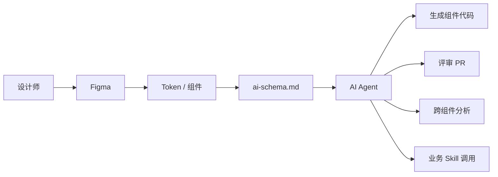

# 🤖 AI 机制 · AI Mechanism

> 让 AI 能消费、校验、生成京东设计系统的协议层。**这里不是写"AI 怎么用",而是写"AI 用什么协议跟设计系统对话"**。

---

## 文档清单

| 文档 | 涵盖 |
|---|---|
| [[naming-bem.md]] | 组件命名规范(BEM-flavored)|
| [[token-sync.md]] | Design Token ↔ Code Token ↔ Figma 三向同步 |
| [[figma-organization.md]] | Figma 文件组织规范(Library / 页面 / 图层命名)|
| [[schema-spec.md]] | `ai-schema.md` 字段规范 |
| [[agent-protocol.md]] | Agent 评审协议(给跨业务 Skill 调用)|
| [[design-review.md]] | `/design-review` skill 索引 — 设计稿合规走查 ✅ 已上线 |
| [[senior-adaptation.md]] | `/senior-adaptation-tool` skill 索引 — 设计稿适老化大字版/长辈版适配 ✅ 已上线 |

---

## AI 在设计系统中的角色

---

## AI 消费的 4 类资产

| 资产类型 | 单一真相源 | 消费形式 |
|---|---|---|
| Token | `tokens.json` | YAML / JSON |
| 组件契约 | `ai-schema.md` | YAML |
| 治理规则 | `donts.md` 中带 ID 的反例 | rule_id 列表 |
| Skill 库 | `ai-mechanism/ai-skills/` | Skill 标准 |

---

## AI Skill 与 Agent

京东积累的设计 Skill(均符合 agentskills.io 标准):

| Skill | 用途 | 状态 |
|---|---|---|
| `jd-double-column-card` | 双列卡观察评价 | v0.5.2 已发布 |
| `/design-review` | Relay 设计稿 vs 15.0 token 合规走查 | **v0.1 已上线**(2026-05-08),详见 [[design-review.md]] |
| `/senior-adaptation-tool` | 设计稿适老化大字版(1.15x)/长辈版(1.3x)适配 | **v2.2.1 已上线**(2026-05-22),详见 [[senior-adaptation.md]] |
| `jd-promotion-theming`(规划) | 大促主题适配 | P2 |
| `jd-a11y-review`(规划) | 无障碍自动 review | P2 |
| `jd-figma-component-sync`(规划) | Figma 组件同步 | P2 |

详见 [[../horizontal/double-column-card/]] 和未来的 [[ai-skills/]] 子目录。

---

## 与 Zone 5 治理的关系

- **Zone 3 AI 机制**:协议 / 工具链 / Schema / Skill
- **Zone 5 governance**:流程 / 评审 / 责任人 / 质量

两个 Zone 互相引用,但维护边界清晰:
- 改 Schema → Zone 3
- 改贡献流程 → Zone 5
- AI Skill 治理(谁能创建 / 怎么评审)→ 跨两个 Zone
