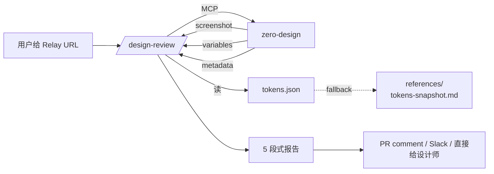

> **2026-05-08 更新**:`/design-review` v0.1.1 新增 **Naming-conflict 前置全局规则**(PR #4 by @liuzhaoran88-rgb)。判定矩阵从 4 档升到 5 档(下方表格)。

# 🛡 /design-review · 设计稿合规走查 Skill

> 把 [`foundations/tokens/tokens.json`](../foundations/tokens/tokens.json) 真正用起来 —— 给定一个 Relay 节点,**自动出一份合规报告**。
>
> 本文档是 wiki 视角的索引页。**Skill 实现**在仓库 `.claude/skills/design-review/`,Claude Code 加载约定要求该路径,不可挪动。

---

## 1. 它是什么

把 PR #1 落成的 6 类 token(色彩 / 文字 / 圆角 / 间距 / 动效 / 图标)+ 结构规范,封装成一个可复用的 Claude Code skill。AI 拉 Relay 设计稿三件套(截图 / variables / metadata),与 `tokens.json` 交叉校验,**输出 5 段式 markdown 报告**:

```
## 设计稿 Review · <nodeId>
**类型识别**:...  **逻辑尺寸**:...

### ❌ 违规(必须改)
### ⚠️ 警告(命名 / 残留 / 语义偏移)
### ✅ 符合 15.0
### 📋 无法仅凭 metadata 判断
### 文字总结
```

每条违规链回 wiki 章节,例如:`tokens/typography.md` §2 字号阶梯。

---

## 2. 何时触发

用户在任意会话里说:
- "审核 / 走查 / review / audit 这个设计稿"
- "符合 15.0 设计规范吗"
- "检查一下用了哪些 token"
- 直接 `/design-review <relay-url>`

skill 的 description 字段已经把关键词 surface 化,自然语言或 slash 命令都能触发。

---

## 3. 判定矩阵

| 严重度 | 触发条件 | 例子 |
|---|---|---|
| ❌ **Naming-conflict**(置 ❌ 段顶部) | 同 fingerprint(lowercase + 去掉 `-` `_`)出现 ≥ 2 个变体且**值不同** | `color_border = #00000014` vs `color-border = #0000000f`(透明度 8% vs 6%) |
| ❌ 违规 | size 不在 5 阶 / 圆角不在 token 表 / 出场时长 > 入场 / token 名带"临时新增" | 13pt"临时新增"(2026-05-06 实跑发现) |
| ⚠️ 命名 | token 名空间错位 | `color_primary_disabled = #c2c4cc` 实际是 `text.disabled` |
| ⚠️ Naming-style(新增) | 同 fingerprint 但**值相同**,只是命名风格不一致 | `spacing_8` vs `Spacing-8` 都是 8px |
| ⚠️ 残留 | 14.x 旧命名 | `C_Newgray03_01`、`日间/...`、`临时新增` 后缀 |
| ⚠️ 语义偏移 | 功能色用错场景 | `service-gold` 用于普通筛选 chip 而非 VIP / 金融 |
| ✅ Pass | 命名 + 值都能映射到 tokens.json | 主色 #ff0f23 → `color.brand.primary` |

### 为什么 Naming-conflict 是前置全局规则

14.x → 15.0 迁移期最普遍的残留模式 —— 同一概念两个 token 同时存在,值已漂移。设计师 / AI 选取时随机命中,是设计漂移**最隐蔽的源头**之一。机器可判,优先扫掉避免后续 3a-3f 重复报。

**触发后的处置**:
- 报告 ❌ 段顶部优先列出
- 每条建议必须显式给出**保留哪个 / 删除哪个**:优先保留 snake_case + 与 15.0 命名空间(`色彩变量 Color/...`)一致的版本
- 同 fingerprint 组内的其他错误(Off-token / Legacy)**仍要标**,但归并到同一组建议下输出

---

## 4. 数据流



**真相源优先级**:
1. `~/code/jd-design-wiki-proposal/jd-design-system-md/foundations/tokens/tokens.json`(在仓库内时)
2. `.claude/skills/design-review/references/tokens-snapshot.md`(回退,版本同步时间在文件头标注)

---

## 5. 文件结构

```
.claude/skills/design-review/
├── SKILL.md                         # 主体(触发 / 4 步流程 / 输出格式 / 失败模式)
├── examples/
│   └── shop-review-half-sheet.md   # 黄金参考(2026-05-06 节点 639:3394 实跑)
└── references/
    └── tokens-snapshot.md           # 离线回退白名单
```

每个文件的目的:

| 文件 | 何时读 | 何时改 |
|---|---|---|
| SKILL.md | 每次触发 | 工作流 / 输出格式调整 |
| examples/*.md | 给 AI 当格式参考 | 跑出新场景的金标准走查后追加 |
| references/tokens-snapshot.md | tokens.json 不可达时 fallback | 与 tokens.json 同步演进(手动) |

---

## 6. 与其他 AI 资产的关系

| 资产 | 与本 skill 的关系 |
|---|---|
| [[../foundations/tokens/tokens.json]] | **真相源** —— skill 主要消费这个 |
| [[token-sync.md]] | Token 三向同步(Figma ↔ Code ↔ tokens.json),保证 skill 读到的真值是最新的 |
| [[schema-spec.md]] | `ai-schema.md` 字段规范 —— skill 输出报告的「规则引用」需要符合该 schema |
| [[agent-protocol.md]] | Agent 评审协议 —— 本 skill 是该协议的具体实现之一 |
| [[naming-bem.md]] | BEM token 命名 —— skill 判定「⚠️ 命名」类问题的依据 |

---

## 7. 已知用例

### 2026-05-06 · 节点 `639:3394`(店铺评价半弹层)
- **结果**: 1 ❌ + 5 ⚠️ + 12 ✅ + 2 📋
- **关键发现**: 设计稿存在 token 名为 `苹方Regular/font_size_13_400(临时新增)` 的字段 → 主流程 13pt 不在 5 阶之内,需要清理
- **完整报告**: [`.claude/skills/design-review/examples/shop-review-half-sheet.md`](../../.claude/skills/design-review/examples/shop-review-half-sheet.md)

---

## 8. 演进路线

| 阶段 | 状态 |
|---|---|
| v0.1 单稿走查输出 markdown | ✅ 2026-05-08 已上线(本文档) |
| v0.2 增加圆角 / 间距 token 推断(从 metadata 几何尺寸反推) | 🔜 P1 |
| v0.3 报告自动落到 Relay 评论 / GitHub PR comment | 🔜 P1 |
| v0.4 批量走查(整 page 或整 file) | 📋 P2 |
| v0.5 灰度对比模式(同节点的 14.x → 15.0 迁移 diff) | 📋 P2 |
| v1.0 接入 CI(设计稿打 tag 自动跑) | 🎯 P3 |

---

## 9. 维护责任

| 角色 | 职责 |
|---|---|
| 平台基础设计组 | 决定哪些 token 加进白名单 / 黑名单 |
| AI 机制组 | 维护 SKILL.md 工作流;升级判定规则 |
| 业务设计师 | 跑走查 + 反馈漏判 / 误判 |
| 工程组 | 把 tokens.json 与代码层 token 保持同步(详见 [[token-sync.md]]) |

---

## 10. 故障排查

| 现象 | 处置 |
|---|---|
| skill 不触发 | 检查 `.claude/skills/design-review/SKILL.md` 存在;Claude Code 重启 |
| 报告说「无法读取 tokens.json」 | 不在仓库 root 触发(skill 用相对路径) → cd 进 `~/code/jd-design-wiki-proposal/` 再跑 |
| MCP transport dropped | 串行重试,见 SKILL.md 「失败模式」节 |
| 用户给的 fileKey 不是 1896756863949619202 | 仍可走 review,但报告会带「不属于 15.0 规范文件」警告标注 |

---

## 11. 引用

- Skill 规范: [agentskills.io](https://agentskills.io/)
- Token 规范: [W3C DTCG](https://design-tokens.github.io/community-group/format/)
- MCP zero-design: 见 Relay 内部文档
