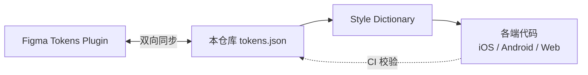

# Token 三向同步 · Token Sync

> 设计稿(Figma)/ 设计文档(本仓库)/ 代码实现 三方保持一致。**任何一方修改必须同步另两方**,否则设计系统失效。

---

## 1. 三向关系



**单一真相源**:`foundations/tokens/tokens.json`(W3C DTCG 兼容)

---

## 2. 双向同步(Figma ↔ 仓库)

### Figma 修改 → 仓库
1. 设计师在 Figma Tokens Plugin 修改色值
2. Plugin 触发 webhook → CI
3. CI 拉取 Plugin 数据 → 生成 PR 到仓库
4. DS 维护组 review → 合入 → tokens.json 更新

### 仓库修改 → Figma
1. 工程师 / DS 维护组在仓库改 tokens.json
2. CI 推送到 Figma Tokens Plugin
3. Figma 自动更新

---

## 3. 仓库 → 各端代码(单向)

通过 Style Dictionary 转换:

| 端 | 输出格式 | 文件名 |
|---|---|---|
| Web | CSS Variables | `tokens.css` |
| iOS | Swift enum | `JDTokens.swift` |
| Android | XML resources | `tokens.xml` |
| React Native | JS object | `tokens.js` |

构建命令:
```bash
npm run tokens:build
# 生成各端 token 文件 → 提 PR 到对应代码库
```

---

## 4. 反向校验(代码 → 仓库)

CI 任务每日扫描代码:
- 是否出现硬编码色值(`#fa2c19`)→ 报错
- 是否出现硬编码 padding(`padding: 16px`)→ 报错
- 是否引用了已删除 / 已 deprecated 的 Token → 报错

---

## 5. Token 变更影响范围

修改 Token 前必须扫描:
```bash
npm run tokens:impact -- color.brand.primary
# 输出:此 Token 被 X 个组件 / Y 个页面引用
```

如果影响 > 50 个组件,**必须走 governance 评审**。

---

## 6. 主题切换实现

```
tokens.default.json  → 默认主题
tokens.618.json      → 618 大促(覆盖 brand 渐变)
tokens.1111.json     → 双 11
tokens.jd-health.json → 京东健康(子品牌)
```

主题包通过 CDN 下发,客户端动态加载(无需发版)。

---

## 7. 工具链清单

| 工具 | 用途 |
|---|---|
| Figma Tokens Plugin | 设计师 Token 编辑 |
| Style Dictionary | Token 转换为各端代码 |
| 京东内部 Token Bridge | webhook + CI 任务 |
| 京东内部 token-impact | 影响范围扫描 |
| 京东内部 token-validator | Token 引用合法性校验 |

---

## 8. 反例

| ❌ 反面 | 解释 |
|---|---|
| 设计师在 Figma 不用 Plugin,直接选色 | Token 不生效 |
| 工程师代码硬编码色值 | CI 自动报错 |
| 改 Token 不评估影响 | 大面积 break |
| 主题切换硬覆盖样式 | 应该 Token 层处理 |
