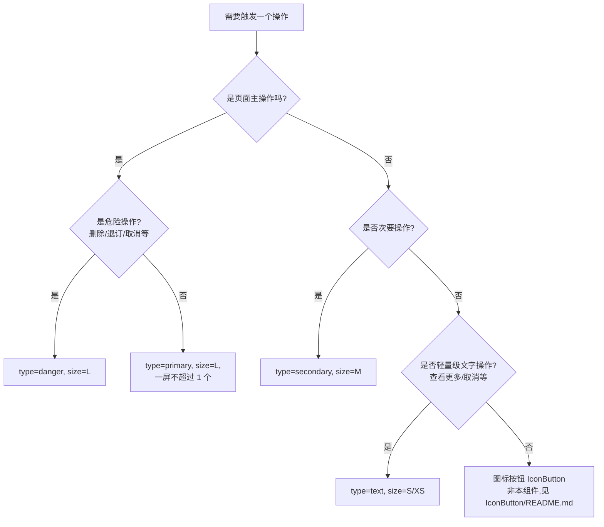

# Button · 按钮

> 用户触发操作的最小单元,贯穿京东 APP 几乎所有页面。**这是一个会被双手反复点的组件,所以视觉、字段、状态机的容错都必须做到 99 分以上**。

---

## 30 秒摘要

| 维度 | 取值 |
|---|---|
| 状态 | `default` / `hover`(仅 iPad/键盘) / `pressed` / `disabled` / `loading` |
| 尺寸 | `L`(48pt) / `M`(40pt) / `S`(32pt) / `XS`(28pt) / `Mini`(24pt) |
| 类型 | `primary` / `secondary` / `text` / `danger` |
| 块状 | `block`(撑满父容器宽) / `inline`(自适应) |
| 图标 | 左 / 右 / 仅图标 / 无 |
| 最小可点区 | 44pt × 44pt(满足 a11y,小尺寸时通过透明热区扩大) |

---

## 文件结构

```
button/
├── README.md           ← 你在这里
├── business.md         PM 视角:解决什么问题、KPI 关联
├── research.md         用研:用户感知、识别成本
├── experience.md       体验:层级关系、组合排布
├── visual.md           视觉:Token 引用、尺寸/类型/状态矩阵
├── interaction.md      交互:点击反馈、loading 衔接、禁用提示
├── content.md          内容:文案规则、字数上限
├── donts.md            反例集合(★ 必看)
├── ai-schema.md        AI 消费字段(YAML)
├── CHANGELOG.md
├── variants/           变体截图
└── examples/           真实使用案例
```

---

## 维护责任(各 md 由谁 own)

| 文件 | 主 owner | 副 owner |
|---|---|---|
| business.md | PM | 数据分析 |
| research.md | 用研 | 体验设计师 |
| experience.md | 体验设计师 | 交互设计师 |
| visual.md | 视觉设计师 | Design System 维护组 |
| interaction.md | 交互设计师 | 前端工程师 |
| content.md | 内容运营 | UX writer |
| donts.md | **集体**(任何人发现新反例都可以提交) | DS 维护组 review |
| ai-schema.md | DS 维护组 | AI 平台工程师 |

---

## 引用关系

**依赖**:
- `[[foundations/tokens/color.md]]` —— 主品牌色 / 语义色 / 中性色
- `[[foundations/tokens/typography.md]]` —— 按钮文案字号阶梯
- `[[foundations/tokens/spacing.md]]` —— 内边距 / 图标-文字间距
- `[[foundations/tokens/radius.md]]` —— 圆角(默认 `radius.8`)
- `[[foundations/tokens/motion.md]]` —— 按下动效(`duration.fast` + `ease-out`)
- `[[horizontal/a11y/checklist.md]]` —— 无障碍接入

**被依赖**(部分,实际更多):
- 几乎所有业务组件(ProductCard 加购、CartItem 提交、Checkout 提交订单 等)
- 所有页面模板(首页、PDP、Cart、Checkout、Pay、Order)

---

## 版本与状态

- **当前版本**:v1.4.2(2026-03-15 发布)
- **状态**:`stable` —— 已大范围使用,Breaking Change 需走 governance 评审
- **下一版**:v1.5(规划中)—— 计划增加 `loading` 状态的进度条变体、`block` 模式响应式自适应

---

## 快速判断:我的场景应该用什么 Button?



---

## 我有问题,该看哪份 md?

| 问题 | 去哪 |
|---|---|
| 这个按钮的 KPI 怎么挂? | [[business.md]] |
| 用户能不能看出禁用状态? | [[research.md#disabled-perception]] |
| 文案最多写几个字? | [[content.md#max-length]] |
| 主色 hover 是什么色值? | [[visual.md#color-states]](实际取自 tokens/color.md) |
| loading 时点击会怎样? | [[interaction.md#loading-behavior]] |
| 我能在 PDP 顶部并排放 3 个主按钮吗? | [[donts.md#multiple-primary]](答案:不能) |
| AI 自动生成 Button 时引用什么? | [[ai-schema.md]] |

---

## 已知历史踩坑(详见 donts.md)

1. **多主按钮并排** —— PDP 早期同时出现"加购物车"+"立即购买"两个 primary,转化率反而下降 3.2%(2024-Q3 A/B 测)
2. **disabled 用品牌色 50% 透明度** —— 视障用户识别率下降 27%(2025-Q1 用研)
3. **loading 状态可点击** —— 早期 loading 时未拦截点击,导致重复提交订单线上事故(2024-12-08 复盘)
4. **文字按钮用品牌红** —— 与正文超链接混淆,用户误以为是链接而非可执行操作

每条都有对应规则写进了 `donts.md`,**违反 donts.md 的 PR 会被自动 block**(governance/quality.md 已配置)。
