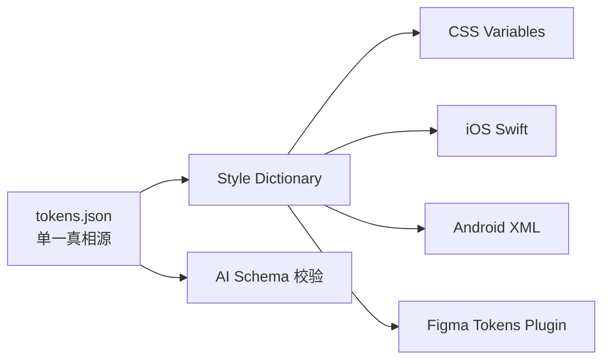

# Design Tokens · 设计语言基础

> Token 是设计系统的 DNA。**一处定义,处处生效**。色值 / 字号 / 间距 / 圆角 / 阴影 / 动效 全部抽象成 Token 后,主题切换、深色模式、大促换肤、Figma 同步、AI 消费才有可能。
>
> **本目录的 markdown 文档是 Token 的"人类可读视图"**,机器读的真相源是 `tokens.json`(W3C DTCG 兼容格式)。

---

## 6 大 Token 类别

| Token 类别 | 文档 | 数量级 |
|---|---|---|
| 🎨 [[color.md]] | 色彩 Token(品牌 / 语义 / 中性 / 功能 / 平台色板 11×10) | ~135 个 ✅ Relay 同步 |
| ✏️ [[typography.md]] | 字体 Token(family / size / weight / lineheight / role) | ~30 个 ✅ Relay 同步 |
| 📐 [[spacing.md]] | 间距 Token(双梯度 平台型/导购型 + 塔式语义 + safe-area) | ~30 个 ✅ Relay 同步 |
| 🟫 [[radius.md]] | 圆角 Token(0/2/4/6/8/12/24/full + 语义) | ~17 个 ✅ Relay 同步 |
| 🌫 [[shadow.md]] | 阴影 Token(elevation 0-5 + 特殊) | ~8 个 ⏳ 15.0 待补充 |
| 🎬 [[motion.md]] | 动效 Token(duration + easing + transition + role) | ~25 个 ✅ Relay 同步 |

---

## 命名规则(BEM-flavored)

```
{category}.{subcategory}.{role}.{state?}

举例:
color.brand.primary           # 品牌主色 #ff0f23(京东红)
color.semantic.danger         # 语义 危险(15.0 中与 brand.primary 同色)
color.neutral.text.primary    # 中性 文字主色 #171a26
color.neutral.bg.surface      # 中性 背景表面 #ffffff
typography.role.heading-page  # 字体 页面主标题(=size.18+semibold+sans)
spacing.4                     # 间距 4pt
radius.role.button            # 圆角 按钮(语义,= radius.base = 6px)
motion.duration.fast          # 动效 时长 快
motion.easing.standard        # 动效 缓动 标准
```

**关键原则**:
- 不允许语义不明的命名(如 `color.red`、`spacing.medium`)
- 语义 Token 引用基础 Token(如 `radius.button = radius.8`),不允许直接定义新值
- 大类前缀必须是 6 大类之一,不允许新增大类(必须走治理流程)

---

## 浅色 / 深色双模式

每个色彩 Token 自带 `light` / `dark` 两个 variant:

```json
{
  "color.brand.primary": {
    "$value": {
      "light": "#fa2c19",
      "dark": "#ff4538"
    }
  }
}
```

设计师在 `visual.md` 引用 Token 时,**不需要**为深色模式单独标注。系统根据当前主题自动取对应值。

例外:
- 渐变色 / 装饰色在深色模式下饱和度需手工调整,详见 [[../../horizontal/multi-platform/dark-mode.md]]

---

## 主题切换(大促 / 子品牌)

通过 Token 主题层实现,**不修改组件代码**:

```
Theme: default      → tokens.default.json
Theme: 618          → tokens.618.json (覆盖品牌色为渐变)
Theme: 1111         → tokens.1111.json
Theme: jd-health    → tokens.jd-health.json (子品牌)
```

主题切换时整个 Token 体系替换,所有组件视觉自动跟随。详见 [[../../horizontal/brand/promotion/]]

---

## 工具链



工具链同步:
- 设计师在 Figma Token Plugin 修改 → CI 同步到 tokens.json → 自动生成各平台代码
- 工程师在代码层硬编码色值 → CI 扫描 → 报错 → 必须改用 Token

---

## 维护流程

| 操作 | 流程 |
|---|---|
| 新增 Token | 走 [[../../horizontal/governance/contribution.md#token-proposal]] |
| 修改 Token 值 | 同上 + 影响评估(扫描所有引用此 Token 的组件) |
| 弃用 Token | 标记 `deprecated`,过渡期 6 个月,期间出现 warning |
| 删除 Token | 弃用期满后 +1 个版本(major bump) |

---

## tokens.json 结构样例(2026-05-06 实际投产 v1.0)

```json
{
  "color": {
    "brand": {
      "primary": {
        "$value": "#ff0f23",
        "$type": "color",
        "$description": "京东红主色,主 CTA / 价格 / 品牌区。Relay: 品牌色/brand_6"
      }
    },
    "semantic": {
      "danger": {
        "$value": "#ff0f23",
        "$type": "color",
        "$description": "错误状态(15.0 中与 brand.primary 同色,通过 wash + 图标区分)"
      }
    }
  },
  "radius": {
    "base": { "$value": "6px", "$type": "dimension", "$description": "默认按钮 / 卡片" }
  }
}
```

完整定义见 [tokens.json](./tokens.json)。

> **注意**:Relay 15.0 当前文件仅提供浅色值,深色 variant 暂未交付。所有 dark mode 字段标记为 TODO。

W3C DTCG 规范:https://design-tokens.github.io/community-group/format/

---

## 引用约束

✅ **允许**:
```css
.button-primary {
  background: var(--color-brand-primary);
  border-radius: var(--radius-button);
}
```

❌ **不允许**:
```css
.button-primary {
  background: #fa2c19;       /* 硬编码 */
  border-radius: 8px;        /* 硬编码 */
}
```

CI 扫描所有 CSS / iOS / Android 代码,违反硬编码规则的 PR 自动 block。

---

## 待办

- [x] tokens.json W3C DTCG 化(2026-05-06 v1.1,覆盖 color / typography / radius / icon / **motion / spacing**)
- [ ] tokens.json 补齐 shadow(Relay 15.0 暂未规范)
- [ ] tokens.json 补齐 dark mode variants(待 Relay 交付深色集)
- [ ] tokens.json 补齐 linear easing(持续型动效,Relay 15.0 未规范)
- [ ] 折叠屏 / iPad 布局规范(Relay 15.0 当前未规范)
- [ ] Style Dictionary 工具链落地(P1)
- [ ] Figma Token Plugin 双向同步(P2)
- [ ] 大促主题包管理后台(P2)
