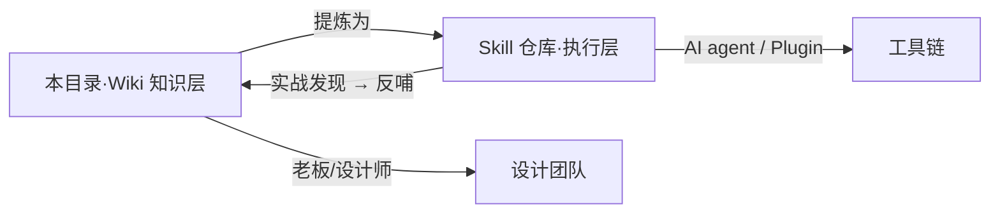

# 🎴 双列卡专项 · Double Column Card

> 京东 App 多业务线共生导致的双列卡体验割裂问题——治理方案已沉淀为可被任意 AI Agent 调用的 Skill。**本目录是给设计师 / 老板看的「知识层」**，给 AI 执行的「契约层」在 Skill 仓库。

**标记图例**（贯穿本目录所有文件）：
- ⭐ = 最核心规约 / 定位锚
- ★ = 标记版本演进（如 ★ v0.5.2 新增）
- ⚠️ = 陷阱 / 关键约束 / 边界
- 💡 = 设计哲学洞察
- ✅ / ❌ = 推荐做法 / 反例
- 🔴 / 🟡 / 🟢 = 优先级 P0 / P1 / P2

---

## 一、为什么要做这件事

京东 App 是多业务线共生的超级平台（推荐 / 点评 / 圈子 / 新品 / 直播 / 个人中心 …）。各业务线各自做双列卡变体导致：

- 用户跨业务线跳转时**识别心智无法复用**
- 设计师跨业务线协作时**没有共同语言**
- AI 工具消费规范时**找不到单一真相源**

本专项不是「制定一份新规范」，而是**把已有的设计规约 + 体验判断标准**机器可读化、agent 可执行化。

---

## 二、核心架构（30 秒理解）

### 五大家族

家族身份由「**底部不变量**」锚定（L1-5 核心规约）—— 顶部和中部统一识别语言，底部保留家族 DNA。

| 家族 | 心理锚点 | 底部 DNA | 卡片"主语" |
| --- | --- | --- | --- |
| 内容 | UGC 信任 + 社交证明 | 头像 + 昵称 + 互动数据 | 创作者 |
| 商品 | 商家背书 + 销量证明 | 店铺 logo + 店铺名 + 销售数据 | 商家 |
| 圈子 | 集体归属感 | 圈子图标 + 圈子名（无作者无互动）| 社群 |
| 点评 | UGC + 决策证明 | 头像 + 昵称 + 互动数据（种草数为激活信号，**非结构标识**¹）| 推荐者 + 决策证明 |
| 新品 | 事件 / 活动 / 趋势驱动 | 按子类型变化 | 抹除主语（聚焦事件本身） |

> **设计哲学**：「**家族身份由底部决定，不由封面决定**」——封面可以任意变化，底部不变 = 家族不变。用户 0.5 秒扫视时锚点在底部。
>
> ¹ 内容家族和点评家族**底部基础结构相同**（都是头像+昵称+互动），区分必须靠 `business_line` 辅助声明，不能靠"有无种草数"——详见 [`donts.md`](./donts.md) 第 2 条 + [`experience.md`](./experience.md) 原则 8。

### 双标签协议

- `business_line`（页面 / 流级）= **人工显式声明**，永远不要推断（`推荐 | 点评 | 圈子 | 新品 | 个人中心 | 直播`）
- `card_type`（单卡级）= **Skill 视觉识别**（VLM 天职，不依赖 tab 或 URL）

为什么分两层：页面内 tab 命名易变（如 JoyAI、求真官等），用可变信号做业务分类不稳定。

### 规则分层

- **L1（9 条跨家族规约）** — 所有卡都必须满足
- **L2（家族专属）** — 按 `card_type` 的家族再走对应规则

详见 [`visual.md`](./visual.md) 和 [`business.md`](./business.md)。

---

## 三、定位（关键边界）

| 是 | 不是 |
| --- | --- |
| 观察 + 评价（discover & explain） | 审查 + 纠错（judge & fix） |
| 给设计师/团队的讨论抓手 | 给评审的判决书 |
| 输出差异 + 体验代价 + 业务合理性 | 输出违规 P0/P1/P2 |

设计哲学：「**这里不一样；可能有 X 体验问题，也可能有 Y 业务合理性——请讨论**」。最终处置权在设计师和评审委员会。

---

## 四、本目录文件导览

| 文件 | 给谁看 | 内容 |
| --- | --- | --- |
| [`README.md`](./README.md) | 任何人 | 本文件，30 秒架构 + 文件导览 |
| [`business.md`](./business.md) | 业务线设计师 / 老板 | 五大家族业务背景 + 22 基线采集 + 家族识别决策树 |
| [`experience.md`](./experience.md) | 设计师 / 评审委员会 | 8 条核心原则 + 体验判断维度工具箱 + 变体评估协议 |
| [`visual.md`](./visual.md) | 设计师 | L1 9 条跨家族规约 + L2 家族专属规则的视觉差异点 |
| [`donts.md`](./donts.md) | Skill 维护者 / 调用方 | 7 条 Skill 不该做的事（含 v0.5.2 血教训）|
| [`ai-schema.md`](./ai-schema.md) | 其他 AI agent | 给 agent 的接入契约 + 输入输出协议 |
| [`CHANGELOG.md`](./CHANGELOG.md) | 维护者 | v0.1 → v0.5.2 关键演进 + 设计哲学迭代 |

> **不在本目录的内容**：所有 prompts/（agent 执行契约）+ references/ 详细数值（22 基线完整字段、L1 决策树伪代码、报告模板等）—— 在 Skill 仓库[执行层](https://github.com/ShuaiMXu/jd-double-column-card-skill)。

---

## 五、Wiki ↔ Skill 的关系



- **Wiki**：解释**为什么**这么定（业务背景、设计哲学、原则演进）
- **Skill**：定义**怎么做**（执行算法、决策树、输出模板）
- **同步规则**：Skill 升级版本时（如 v0.5.2 新增原则 7/8），同步更新本目录 `CHANGELOG.md` + 受影响的 .md

---

## 六、调用方式

### Agent 调用

```
1. Read https://github.com/ShuaiMXu/jd-double-column-card-skill/SKILL.md
2. Read prompts/page-level-review.md（执行契约入口）
3. 输入：截图 + business_line（人工声明）
4. 输出：差异观察报告（三段式：整体印象 + 差异表 + 下一步）
```

### 设计师阅读路径

```
本 README → business.md（理解家族） → visual.md（看规约） → experience.md（学判断） → donts.md（避坑）
```

---

## 七、与 Design Wiki 其他 Zone 的关系

| 关联 Zone | 接入点 |
| --- | --- |
| **Zone 4 product-architecture** | 各事业部业务组件继承家族 DNA。主站 ProductCard 必须遵守商品家族 L1+L2 规约 |
| **Zone 5 horizontal/governance** | 跨 BG 双列卡冲突 → 走 governance 评审流程 |
| **Zone 3 ai-mechanism** | 本 Skill 是 ai-mechanism 的样例实现，参考 schema-spec |
| **Zone 2 foundations/tokens** | 视觉规约引用 tokens.json 的 spacing / radius / typography |

---

## 八、维护

- **专项组**：综合业务设计组（Shaka 主导）
- **Review**：DS 维护组 + 评审委员会
- **更新触发**：每发现新基线 / 新规则 / Skill 版本升级 → 立即更新本目录对应文件

---

## 九、待补事项

- `references/jd-15-spec.md`（Skill 仓库内）空壳待注入官方 token —— 等 15.0 设计语言完整落地
- 基线采集缺口：圈子视频卡（按规律预测，未采）、商品图文卡基础款
- L2 规则缺口：商品家族 L2 完整规则待补（当前商品卡只走 L1）
- 真实跨 agent 验证（PE 模板已就位，待另一个 agent 独立跑过验证闭环）
