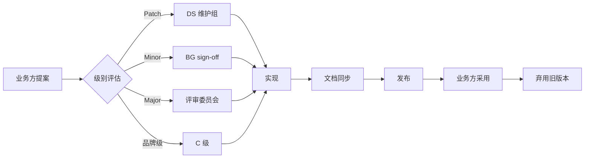

# 🏛 治理 · Governance

> 设计系统的"宪法和法律"。**对应 PDF 大纲第 12 章 设计系统治理**。

---

## 文档清单

| 文档 | 涵盖 |
|---|---|
| [[contribution.md]] | 组件贡献流程(提案 → 评审 → 实现 → 文档 → 发布) |
| [[versioning.md]] | 版本管理(SemVer + Breaking Change) |
| [[quality.md]] | 质量保障 checklist + CI 强制约束 |
| [[design-dev-collab.md]] | 设计开发协作(标注 / Design QA / Token 实现) |
| [[doc-maintenance.md]] | 文档维护责任与更新周期 |
| [[org.md]] | 组织架构(联邦制 vs 集中制)|

---

## 治理核心原则

| 原则 | 说明 |
|---|---|
| 透明 | 所有规则文档化,不允许"心照不宣" |
| 可证 | 每条规则有数据 / 历史依据,不只是个人偏好 |
| 可被挑战 | 规则可被业务方提案修改,走流程 |
| 可强制 | 关键规则(如硬约束)由 CI 自动 enforce |

---

## 角色与职责

| 角色 | 职责 |
|---|---|
| **DS 维护组**(Design System Team)| Foundations 维护 / 跨 BG review / 治理流程 |
| **业务设计师**(各 BG)| Zone 4 业务组件 + 页面贡献 |
| **品牌总监**(Brand Director)| Logo / 品牌色 / Joy / 大促资产 |
| **评审委员会**(Steering Committee)| 重大变更投票 |
| **AI Agent**(自动化)| ai-schema 校验 + a11y 自动跑 + Token 引用扫描 |

---

## 4 类变更级别

| 级别 | 影响 | 流程 |
|---|---|---|
| **Patch** | 修复 bug / 文档勘误 | DS 维护组 review → 直接合 |
| **Minor** | 新增功能 / 新组件 | DS 维护组 review + 1 个业务 BG sign-off |
| **Major / Breaking** | 改变 API / 删除 Token | 评审委员会投票(2/3 赞成)|
| **品牌级** | 改变 Logo / 京东红 | C 级 + 法务 + 品牌总监 |

---

## 关键流程

---

## 治理频次

| 活动 | 频次 |
|---|---|
| DS 维护组站会 | 每日 15 min |
| 跨 BG 评审 | 每周一次 |
| Foundations review | 每月一次 |
| 评审委员会会议 | 每季度一次 |
| 大版本发布 | 每半年一次 |
