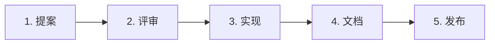

# 贡献流程 · Contribution

> 任何人(设计师 / PM / 工程师 / 用研 / 运营)向京东设计系统贡献的标准流程。

---

## 1. 5 步标准流程



---

## 2. 步骤详解

### 1) 提案
- 在 GitHub Issue 或内部 RFC 系统提交
- 模板:
  ```markdown
  # 提案标题
  ## 背景(为什么需要)
  ## 方案(具体怎么做)
  ## 影响范围(影响哪些组件 / 业务方)
  ## 预期收益(数据 / 体验 / 维护性)
  ## 替代方案(为什么不那么做)
  ```

### 2) 评审
- DS 维护组先 review,判断变更级别
- 根据级别走对应流程(详见 [[README.md#变更级别]])
- 输出:approve / request-changes / reject

### 3) 实现
- 设计师在 Figma 实现 → 同步到 Library
- 工程师实现代码 → 接入 Token / Schema
- 跑 CI 校验

### 4) 文档
- 更新 ai-schema.md
- 更新 visual.md / business.md / donts.md(各角色 own 各自部分)
- 更新 CHANGELOG.md

### 5) 发布
- DS 维护组合入主分支
- 自动发版 + 通知业务方
- 旧版本进入 deprecated 状态(若 Breaking)

---

## 3. 变更级别判定标准

```yaml
patch:
  examples:
    - 文档勘误
    - 修复 bug(API 不变)
    - 调整非视觉细节
  flow: DS 维护组 review → 直接合

minor:
  examples:
    - 新增组件
    - 新增 Token
    - 新增 prop / variant(向后兼容)
    - 新增 Skill
  flow: DS 维护组 + 至少 1 个业务 BG sign-off

major:
  examples:
    - 删除 / 重命名 prop(API 改变)
    - 删除 Token(影响多组件)
    - 改变默认值
  flow: 评审委员会投票(2/3 赞成)+ 6 个月过渡期

brand_level:
  examples:
    - 改变 Logo
    - 改变京东红色值
    - 改变品牌字体
  flow: C 级 + 法务 + 品牌总监 + 全员通告
```

---

## 4. 业务 BG 提"扩展提案"

业务方需要超出 Foundations 的能力(如 ProductCard 新变体):
- 提交"扩展提案"
- 说明业务诉求 + 与 Foundations 的差异
- DS 维护组评估:
  - 应该进 Foundations(如多个 BG 都需要)→ 升级到 Foundations
  - 应该独占 BG 维护(差异化业务)→ 维护在该 BG 目录

---

## 5. 弃用流程

```
1. 标记 deprecated(状态从 stable → deprecated)
2. CHANGELOG 添加弃用说明
3. ai-schema 添加 deprecated_in_version + replaced_by
4. 6 个月过渡期内出现 warning(代码层面)
5. 过渡期满 → 下个 major 版本删除
```

---

## 6. 第三方贡献

外部团队(如京东国际、京东工业)贡献:
- 走同一流程
- DS 维护组协助 onboarding
- 第一次贡献加配 mentor

---

## 7. 反例

| ❌ 反面 | 解释 |
|---|---|
| 业务方私自修改 Foundations | 必须走治理 |
| 不写 ai-schema 直接发版 | CI 自动 block |
| Major 变更不评审委员会投票 | 治理失效 |
| 弃用不留过渡期 | 业务方 break |
| 不通知业务方就 deprecated | 信息不对称 |
