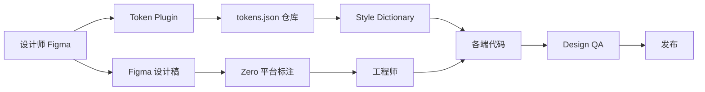

# 设计开发协作 · Design-Dev Collaboration

> 设计师 → 工程师 → 上线 的标准协作流程。**核心目标:让 Token 在两端一字不差地落地**。

---

## 1. 协作流水线



---

## 2. 设计稿交付

设计稿在 Zero 平台发布(京东内部标注平台):

| 内容 | 责任方 |
|---|---|
| 设计稿 | 设计师在 Figma 完成 |
| 标注 | Zero 自动生成(尺寸 / 间距 / 色值) |
| 切图 | Zero 多倍图导出(@1x / @2x / @3x) |
| Token 引用 | Inspect 显示 `var(--color-...)` 而非具体色值 |

---

## 3. Design QA(设计验收)

工程师实现完后,设计师验收:

### 验收 checklist
- [ ] Token 引用正确(无硬编码)
- [ ] 状态完整(default / pressed / disabled / loading)
- [ ] 浅色 / 深色模式都达标
- [ ] 极端字号(85% / 150%)不崩
- [ ] 跨端(iOS / Android)一致
- [ ] 动效时长 / 缓动符合 motion Token
- [ ] a11y 字段齐全

### 工具
- 京东内部 DesignQA 平台:截图对比 + 像素级差异
- Zero Inspect:Token 引用校验

---

## 4. Token 实现校验

### 设计稿 → 代码
工程师从 Figma Inspect 拿到 Token 名:
```
设计稿: color.brand.primary
        ↓
代码:   var(--color-brand-primary)
```

### CI 校验
```bash
# 扫描代码中所有色值 / spacing / radius
npm run lint:tokens
# 输出:发现 N 处硬编码 → 转 Token
```

---

## 5. 跨端一致性

iOS / Android 同时实现一个组件:
- 设计稿一份(共享)
- Token 一份(共享)
- 代码各自实现
- 视觉验收同时跑两端

---

## 6. 设计师与工程师沟通

### 标准沟通模板(给工程师)
```
组件:Button v1.4.2
设计稿:[Figma 链接]
Token 依赖:color.brand.primary / spacing.button.padding-h.L / ...
状态:default / pressed / disabled / loading
特殊行为:loading 拦截点击
a11y:min_touch_target=44pt / contrast=4.5:1
```

### 模糊点 / 决策点
- 设计师写明"为什么这样"(业务背景 / 数据)
- 工程师不要私自改(疑问点提 issue)

---

## 7. 协作工具栈

| 工具 | 用途 |
|---|---|
| Figma | 设计稿 |
| Figma Tokens Plugin | Token 编辑 |
| Zero | 标注 / 切图 / Token 引用 |
| Style Dictionary | Token 转代码 |
| 京东内部 DesignQA | 视觉验收 |
| GitHub / GitLab | 代码 review |
| 内部 Wiki | 设计文档 |

---

## 8. 常见踩坑

| 问题 | 原因 | 解决 |
|---|---|---|
| 工程师硬编码色值 | 不知道 Token 体系 | onboarding + CI 强制 |
| 跨端视觉不一致 | 设计稿没考虑平台差异 | 设计稿包含 iOS / Android 两版 |
| Design QA 找不到差异 | 工具不到位 | 使用 DesignQA 平台像素级对比 |
| Token 引用错(用了 brand 而不是 semantic) | 命名不直观 | onboarding + 命名 review |

---

## 9. 反例

| ❌ 反面 | 解释 |
|---|---|
| 设计稿不在 Figma(在 Sketch / PS)| 工具链断裂 |
| 不用 Zero 直接写色值 | 硬编码 |
| 工程师不验收设计稿就上线 | 视觉错位 |
| 跨端不统一 review | 一端达标一端不达标 |
| 设计稿不写 Token 名 | 工程师猜 |
