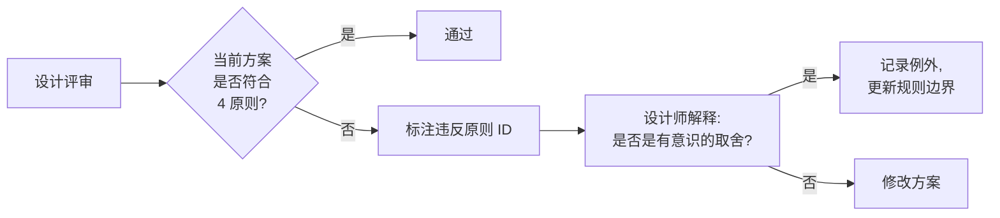

# 设计哲学 · Design Philosophy

> 哲学是判断标准。每一次设计评审、每一个组件取舍、每一条规则的来源都应该回到这四条原则。
>
> **不要把哲学写成口号挂在墙上**。本文的每条原则都标注了"什么场景该引用它"+"它的反面是什么"。

---

## 四大原则总览

| 原则 | 一句话定位 | 反面 | 引用场景 |
|---|---|---|---|
| 🎯 [[focused-effective.md]]<br>**聚焦实效** | 一切为转化让路,信息密度 + 决策路径优先 | 装饰过度 / 视觉自嗨 | PDP / 购物车 / 结算页评审 |
| 🧱 [[simple-unified.md]]<br>**简洁统一** | 模块化 + 跨业务一致性 | 各业务线各自开花 | 双列卡评审、新业务孵化 |
| 🤝 [[inclusive.md]]<br>**多元包容** | 无障碍 + 适老 + 极端字号 | 默认人群假设 | 任何 PR 必过的横向 checklist |
| ✨ [[brand-expression.md]]<br>**品牌表现** | 京东红 + Joy + 节庆基因 | 品牌弱化 / 拟物泛滥 | 大促主题、子品牌设计、Logo 使用 |

---

## 哲学的"运作机制"



**关键设计**:
- 设计师可以"违反"原则,但必须**有意识**地违反并记录
- 不允许"无感违反" —— 所有违反都要走例外流程
- 例外日久成新规则

---

## 4 原则在 5 Zone 中的渗透

| Zone | 主导原则 |
|---|---|
| 📚 知识(本 Zone) | 全部 4 条 |
| 🎨 Design 基础 | 聚焦实效 + 简洁统一 |
| 🤖 AI 机制 | 简洁统一(命名 / Schema 一致性)|
| 🏗 组织架构 | 聚焦实效(各业务 KPI)+ 多元包容 |
| 🚀 横向专项 | 简洁统一(双列卡)+ 多元包容(a11y)+ 品牌表现(大促)|

---

## 引用约定

每个组件 README.md 顶部应包含:
```yaml
philosophy_alignment:
  primary: focused-effective
  secondary: [simple-unified]
  acknowledged_tradeoff: 可选,说明在哪条原则上做了让步及原因
```

AI Agent 在评审时会读取此字段,验证组件设计是否一致。

---

## 历史脉络(给新加入的同事)

- **v1.0(2026-04)** 现行版本:四大原则首次成文,与京东 15.0 设计语言同步发布
- **v0.x(2024-2025)** 各业务线各自表述,无统一哲学层
- **京东 15.0 之前** 视觉语言松散,主要靠"经验和感觉"

> **为什么现在做哲学统一**:京东 APP 是多业务线共生的超级 App,缺乏哲学层导致跨业务体验割裂(双列卡 / Banner 风格 / 文案口吻全部分裂)。哲学统一是 Token / 组件 / 治理的前置条件。
