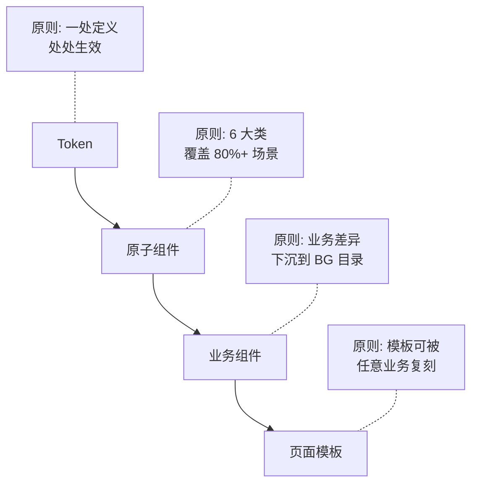

# 🧱 简洁统一

> 京东 APP 是上百个业务模块拼装的超级 App。**用户不应该感受到这是 100 个团队做的产品**。
>
> 简洁 = 视觉降噪。统一 = 跨业务的体验连贯性。两者一体两面。

---

## 1. 核心主张

| 主张 | 具体表现 |
|---|---|
| 模块化思维 | 组件 / Token / 模板可被任意业务复用 |
| 跨业务一致性 | 同样的功能在不同业务线长得一样 |
| 视觉降噪 | 留白、克制、低饱和(除品牌区) |
| 唯一真相源 | 同一规则同一处定义,不允许多源 |

---

## 2. 模块化的三层



**关键约定**:
- **Token** 是单一真相源(`tokens.json`)
- **原子组件** 全公司共用,不允许各 BG 自建
- **业务组件** 各 BG 自维护(避免最大公约数化丢失差异)
- **页面模板** 提供骨架,业务方填充内容

---

## 3. 跨业务一致性 · 三层标准

| 层 | 一致程度 | 例子 |
|---|---|---|
| L1 视觉语言 | **必须完全一致**(token + 原子组件) | 主色 / 字号 / 圆角 / Button / Input |
| L2 信息架构 | **结构一致,内容差异化** | 双列卡 family 锚定 + 卡型变体 |
| L3 业务表达 | **充分差异化** | 生鲜的"30 分钟达"标识 / 健康的"医生认证"标识 |

**违反 L1 = 体验割裂事故**(必须修)
**违反 L2 = 体验割裂风险**(评审委员会拍板)
**违反 L3 = 没问题**(本来就该差异化)

---

## 4. 反面是什么

| ❌ 反面行为 | 解释 |
|---|---|
| 各业务自建按钮 | 同样是"加购",不同业务长得不一样 |
| 多套 Token 并存 | 主站红 #fa2c19,生鲜红 #ff3322,健康红 #fa2519 |
| 文案口吻分裂 | 主站"提交订单",超市"立即下单",生鲜"马上买" |
| 隐形规则 | 规则只存在某个设计师的脑子里,不写文档 |

---

## 5. 简洁的具体执行

| 维度 | 简洁标准 |
|---|---|
| 色彩 | 主体页面用 ≤ 5 个色(品牌红 + 文字 3 阶 + 中性灰)|
| 字体 | 4 套字号阶梯(标题 / 正文 / 辅助 / 数字),不另起新阶 |
| 装饰 | 首屏装饰元素 ≤ 20% 面积 |
| 弹窗 | 一屏不超过 2 个层叠弹窗 |
| 角标 | 一张卡片不超过 3 个角标 |

---

## 6. 引用此原则的场景

- **新业务孵化**:新事业部上线,确认是否复用统一 Token 和原子组件
- **双列卡评审**:[[horizontal/double-column-card/]] family 锚定即此原则的具象化
- **Token 提案**:任何"我想加个新色值"提案先回到此原则
- **跨 BG 评审**:不同事业部同类页面对照,识别违反点

---

## 7. 与其他原则的张力

**与"品牌表现"**:某些子品牌(京东健康 / 京东金融)有自己的辅助色 → 这是 L3 业务差异,不违反 L1 主色统一
**与"聚焦实效"**:简洁可能牺牲信息密度 → 大促 / 转化关键页可适度放宽简洁约束

---

## 8. 治理机制

简洁统一不靠自觉,靠治理:
- **Token 单一真相源**:CI 扫描代码硬编码色值 → 自动 block
- **原子组件唯一性**:Figma Library 锁定 → 设计师不能 detach
- **跨 BG 季度评审**:[[horizontal/governance/quality.md]]
- **双列卡 family 检测**:Skill 自动跑

---

## 9. AI 检查清单

```yaml
simple_unified_check:
  - id: token_single_source
    rule: 视觉规则只能引用 Token,不允许硬编码
  - id: cross_bg_consistency_l1
    rule: L1 视觉语言违反必须 block
  - id: max_decoration_per_screen
    rule: 装饰元素 ≤ 20% 面积
  - id: family_dna_anchor
    rule: 双列卡底部不变量必须保留
```
