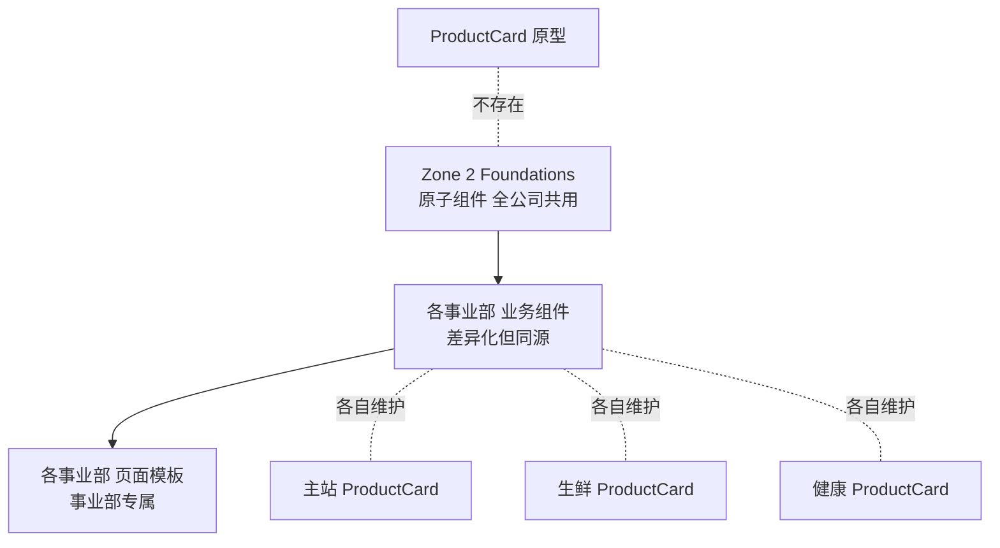

# 🏗 组织架构 · Organizational Architecture

> **业务线设计师的主战场**。本 Zone 的内容按"部门 → 业务 → 组件"三级组织,与京东组织架构对齐。
>
> 重要:**业务组件不进 foundations**。每个事业部维护自己的业务组件,共享 foundations 层的 Token 和原子组件。

---

## 为什么这样组织



**核心判断**:商品卡(`ProductCard`)在主站 / 生鲜 / 健康 形态完全不同。把它当"全公司共用"会变成最大公约数,失去差异化。**正确做法是各部门维护自己的 ProductCard 变体,共享 Zone 5 的双列卡治理规则**。

---

## 京东事业部目录

| 事业部 | 简称 | 文档 | P1 优先级 |
|---|---|---|---|
| 主站事业群(零售)| `retail-bg` | [[retail-bg/README.md]] | ★ 高 |
| 京东超市 | `supermarket-bg` | (P2 补充) | 中 |
| 京东生鲜 | `fresh-bg` | (P2 补充) | 中 |
| 京东健康 | `health-bg` | (P2 补充) | 中 |
| 京东金融 | `finance-bg` | (P3 补充) | 低 |
| 京东物流 | `logistics-bg` | (P3 补充) | 低 |
| 京东工业 | `industrial-bg` | (P3 补充) | 低 |
| 京东国际 | `global-bg` | (P3 补充) | 低 |
| 跨事业部共享 | `cross-bg` | (用户中心 / 客服 / 设置 等) | 高 |

---

## 每个事业部的标准目录

```
{bg}/
├── README.md                       # 事业部介绍 + 业务方向
├── components-business/            # 业务组件
│   ├── README.md                   # 6 大类索引
│   ├── product-card/               # 商品卡(本部门变体)
│   ├── cart-item/
│   ├── coupon/
│   └── ...
└── pages/                          # 页面模板
    ├── README.md                   # 12 个核心页索引
    ├── home/
    ├── search/
    ├── pdp/
    └── ...
```

---

## 跨事业部协作

| 场景 | 处理方式 |
|---|---|
| 同名组件不同形态(主站 / 生鲜 ProductCard) | 各自维护,共享 family DNA |
| 跨 BG 用户(用户中心 / 消息) | 进 `cross-bg/` |
| 主站规则被其他 BG 借用 | 引用,不复制 |
| 跨 BG 体验冲突 | 上 horizontal/governance 评审 |

---

## 与 Zone 5 治理的关系

- **业务组件的 family DNA 由 horizontal 定义**(如双列卡五大家族锚定)
- **业务组件的实现由各事业部 own**
- **跨事业部冲突由 horizontal/governance 仲裁**

```
horizontal/double-column-card/  ← 跨事业部规则(Skill)
    ↓ 引用
retail-bg/components-business/product-card/         ← 主站实现
fresh-bg/components-business/product-card/          ← 生鲜实现
health-bg/components-business/product-card/         ← 健康实现
```

---

## 维护责任

每个事业部:
- **业务组件 owner**:该事业部体验设计师
- **页面模板 owner**:该事业部体验设计师 + PM
- **跨 BG 引用 review**:DS 维护组 + 双方业务方
